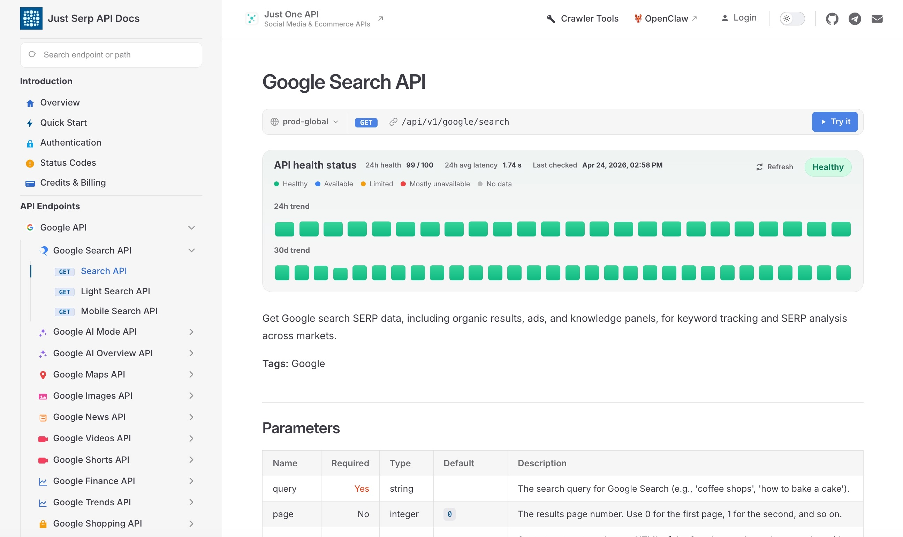

<p align="center">
  <a href="https://justserpapi.com/?utm_source=github.com&utm_medium=referral&utm_campaign=justserpapi_justserpapi_python&utm_content=repo_readme_logo">
    
  </a>
</p>

<h1 align="center">JustSerpAPI Python SDK</h1>

<p align="center">
  <a href="https://pypi.org/project/justserpapi/">
    
  </a>
  <a href="https://pypi.org/project/justserpapi/">
    
  </a>
  <a href="https://docs.justserpapi.com">
    
  </a>
  <a href="LICENSE">
    
  </a>
</p>

OpenAPI-driven Python SDK for [JustSerpAPI](https://justserpapi.com/?utm_source=github.com&utm_medium=referral&utm_campaign=justserpapi_justserpapi_python&utm_content=repo_readme) with a stable high-level `Client` as the public entrypoint.

## Platform Overview

The documentation center helps you browse endpoint health, versioned API paths, request parameters, and SERP-specific usage notes.

[](https://docs.justserpapi.com/?utm_source=github.com&utm_medium=referral&utm_campaign=justserpapi_justserpapi_python&utm_content=repo_readme_docs_image)

The console provides API key management, subscription status, credit visibility, request logs, usage trends, and credit consumption analytics.

[](https://dashboard.justserpapi.com/?utm_source=github.com&utm_medium=referral&utm_campaign=justserpapi_justserpapi_python&utm_content=repo_readme_dashboard_image)

## Installation

```bash
pip install justserpapi
```

## Quick Start

```python
from justserpapi import Client

with Client(api_key="YOUR_API_KEY") as client:
    response = client.google.search(
        query="coffee shops in New York",
        location="New York, NY",
        language="en",
    )
    print(response)
    print(response["data"])
```

## Promoted High-Level API

The high-level surface is designed to be the default entrypoint:

```python
from justserpapi import Client

client = Client(api_key="YOUR_API_KEY", timeout=20.0)

search = client.google.search(query="best espresso beans", language="en")
maps = client.google.maps.search(query="espresso bars", location="Shanghai")
news = client.google.news.search(query="OpenAI", language="en")
images = client.google.images.search(query="espresso machine")
shopping = client.google.shopping.search(query="espresso tamper")
overview = client.google.ai.overview(url="https://example.com/ai-overview")

print(search["data"])

client.close()
```

Promoted high-level responses are plain Python dictionaries that mirror the API's JSON response envelope. The SDK does not auto-unpack `data`.

## Configuration

The public client exposes the common knobs directly:

```python
from justserpapi import Client
from urllib3.util.retry import Retry

client = Client(
    api_key="YOUR_API_KEY",
    base_url="https://api.justserpapi.com",
    timeout=(5.0, 30.0),
    retries=Retry(total=5, backoff_factor=0.5),
)
client.close()
```

- `api_key`: value sent in the `X-API-Key` header
- `base_url`: API host, defaults to `https://api.justserpapi.com`
- `timeout`: default request timeout injected into promoted high-level methods
- `retries`: `urllib3` retry configuration; defaults to a conservative retry strategy for the high-level client

## OpenAPI Control Plane

This repository only owns the Python SDK. The canonical OpenAPI document plus the Python-specific control-plane files in `config/`, `scripts/`, and `overlays/python/` drive generation and validation.

- If `openapi/justserpapi.openapi.json` is committed, local generation is fully reproducible.
- If it is not committed, CI can fetch and cache it by running `python scripts/sdkctl.py fetch-spec` with `JUSTSERPAPI_API_KEY` configured.

If the API changes, update these files:

- `openapi/justserpapi.openapi.json`: the current canonical spec used to validate and generate the SDK
- `openapi/baseline/justserpapi.openapi.json`: the previous released spec snapshot used only for breaking-change checks

Typical maintenance flow after an API change:

```bash
cp /path/to/latest-openapi.json openapi/justserpapi.openapi.json
python scripts/sdkctl.py validate-examples
python scripts/sdkctl.py validate-spec
python scripts/sdkctl.py breaking-check
python scripts/sdkctl.py generate --clean
```

If this new spec is the one you are about to release, update the baseline after validation:

```bash
cp openapi/justserpapi.openapi.json openapi/baseline/justserpapi.openapi.json
```

## Release

Official releases are tag-driven:

```bash
python scripts/sdkctl.py validate-examples
python scripts/sdkctl.py verify-release --tag vX.Y.Z
python -m build
git push origin vX.Y.Z
```

- The package version comes from `justserpapi/_version.py`
- If `openapi/justserpapi.openapi.json` is committed, its `info.version` must match the tag and package version
- GitHub Actions publishes tagged releases to PyPI through Trusted Publishing

## Service Overview

The API list below is generated from OpenAPI and shows the current public API categories and endpoint names. See the [online API documentation](https://docs.justserpapi.com/?utm_source=github.com&utm_medium=referral&utm_campaign=justserpapi_justserpapi_python&utm_content=repo_readme_api_list) for full request and response details.

<!-- API_LIST_START -->

### Google Search API

- [Search API](https://docs.justserpapi.com/api/v1/google/search?utm_source=github.com&utm_medium=referral&utm_campaign=justserpapi_justserpapi_python&utm_content=repo_readme_api_list)
- [Light Search API](https://docs.justserpapi.com/api/v1/google/search/light?utm_source=github.com&utm_medium=referral&utm_campaign=justserpapi_justserpapi_python&utm_content=repo_readme_api_list)
- [Mobile Search API](https://docs.justserpapi.com/api/v1/google/search/mobile?utm_source=github.com&utm_medium=referral&utm_campaign=justserpapi_justserpapi_python&utm_content=repo_readme_api_list)

### Google AI Mode API

- [AI Mode API](https://docs.justserpapi.com/api/v1/google/ai-mode?utm_source=github.com&utm_medium=referral&utm_campaign=justserpapi_justserpapi_python&utm_content=repo_readme_api_list)

### Google AI Overview API

- [AI Overview API](https://docs.justserpapi.com/api/v1/google/ai-overview?utm_source=github.com&utm_medium=referral&utm_campaign=justserpapi_justserpapi_python&utm_content=repo_readme_api_list)

### Google Maps API

- [Maps Search API](https://docs.justserpapi.com/api/v1/google/maps/search?utm_source=github.com&utm_medium=referral&utm_campaign=justserpapi_justserpapi_python&utm_content=repo_readme_api_list)
- [Maps Posts API](https://docs.justserpapi.com/api/v1/google/maps/posts?utm_source=github.com&utm_medium=referral&utm_campaign=justserpapi_justserpapi_python&utm_content=repo_readme_api_list)
- [Maps Photos API](https://docs.justserpapi.com/api/v1/google/maps/photos?utm_source=github.com&utm_medium=referral&utm_campaign=justserpapi_justserpapi_python&utm_content=repo_readme_api_list)
- [Maps Reviews API](https://docs.justserpapi.com/api/v1/google/maps/reviews?utm_source=github.com&utm_medium=referral&utm_campaign=justserpapi_justserpapi_python&utm_content=repo_readme_api_list)
- [Maps Place Details API](https://docs.justserpapi.com/api/v1/google/maps/places?utm_source=github.com&utm_medium=referral&utm_campaign=justserpapi_justserpapi_python&utm_content=repo_readme_api_list)

### Google Images API

- [Images Search API](https://docs.justserpapi.com/api/v1/google/images/search?utm_source=github.com&utm_medium=referral&utm_campaign=justserpapi_justserpapi_python&utm_content=repo_readme_api_list)

### Google News API

- [News Search API](https://docs.justserpapi.com/api/v1/google/news/search?utm_source=github.com&utm_medium=referral&utm_campaign=justserpapi_justserpapi_python&utm_content=repo_readme_api_list)

### Google Videos API

- [Videos Search API](https://docs.justserpapi.com/api/v1/google/videos/search?utm_source=github.com&utm_medium=referral&utm_campaign=justserpapi_justserpapi_python&utm_content=repo_readme_api_list)

### Google Shorts API

- [Shorts Search API](https://docs.justserpapi.com/api/v1/google/shorts/search?utm_source=github.com&utm_medium=referral&utm_campaign=justserpapi_justserpapi_python&utm_content=repo_readme_api_list)

### Google Finance API

- [Finance Search API](https://docs.justserpapi.com/api/v1/google/finance/search?utm_source=github.com&utm_medium=referral&utm_campaign=justserpapi_justserpapi_python&utm_content=repo_readme_api_list)

### Google Trends API

- [Google Trends Search API](https://docs.justserpapi.com/api/v1/google/trends/search?utm_source=github.com&utm_medium=referral&utm_campaign=justserpapi_justserpapi_python&utm_content=repo_readme_api_list)
- [Google Trends Autocomplete API](https://docs.justserpapi.com/api/v1/google/trends/autocomplete?utm_source=github.com&utm_medium=referral&utm_campaign=justserpapi_justserpapi_python&utm_content=repo_readme_api_list)
- [Google Trends Trending Now API](https://docs.justserpapi.com/api/v1/google/trends/trending-now?utm_source=github.com&utm_medium=referral&utm_campaign=justserpapi_justserpapi_python&utm_content=repo_readme_api_list)

### Google Shopping API

- [Shopping Search API](https://docs.justserpapi.com/api/v1/google/shopping/search?utm_source=github.com&utm_medium=referral&utm_campaign=justserpapi_justserpapi_python&utm_content=repo_readme_api_list)

### Google Immersive Product API

- [Immersive Product API](https://docs.justserpapi.com/api/v1/google/immersive/product?utm_source=github.com&utm_medium=referral&utm_campaign=justserpapi_justserpapi_python&utm_content=repo_readme_api_list)

### Google Autocomplete API

- [Autocomplete API](https://docs.justserpapi.com/api/v1/google/autocomplete?utm_source=github.com&utm_medium=referral&utm_campaign=justserpapi_justserpapi_python&utm_content=repo_readme_api_list)

### Google Scholar API

- [Google Scholar Search API](https://docs.justserpapi.com/api/v1/google/scholar/search?utm_source=github.com&utm_medium=referral&utm_campaign=justserpapi_justserpapi_python&utm_content=repo_readme_api_list)
- [Google Scholar Author API](https://docs.justserpapi.com/api/v1/google/scholar/author?utm_source=github.com&utm_medium=referral&utm_campaign=justserpapi_justserpapi_python&utm_content=repo_readme_api_list)
- [Google Scholar Cite API](https://docs.justserpapi.com/api/v1/google/scholar/cite/search?utm_source=github.com&utm_medium=referral&utm_campaign=justserpapi_justserpapi_python&utm_content=repo_readme_api_list)

### Google Lens API

- [Lens API](https://docs.justserpapi.com/api/v1/google/lens?utm_source=github.com&utm_medium=referral&utm_campaign=justserpapi_justserpapi_python&utm_content=repo_readme_api_list)

### Google Jobs API

- [Jobs Search API](https://docs.justserpapi.com/api/v1/google/jobs/search?utm_source=github.com&utm_medium=referral&utm_campaign=justserpapi_justserpapi_python&utm_content=repo_readme_api_list)

### Google Local API

- [Local Search API](https://docs.justserpapi.com/api/v1/google/local/search?utm_source=github.com&utm_medium=referral&utm_campaign=justserpapi_justserpapi_python&utm_content=repo_readme_api_list)

### Google Patents API

- [Google Patents Search API](https://docs.justserpapi.com/api/v1/google/patents/search?utm_source=github.com&utm_medium=referral&utm_campaign=justserpapi_justserpapi_python&utm_content=repo_readme_api_list)
- [Google Patents Details API](https://docs.justserpapi.com/api/v1/google/patents/details?utm_source=github.com&utm_medium=referral&utm_campaign=justserpapi_justserpapi_python&utm_content=repo_readme_api_list)

### Google Hotels API

- [Hotels Search API](https://docs.justserpapi.com/api/v1/google/hotels/search?utm_source=github.com&utm_medium=referral&utm_campaign=justserpapi_justserpapi_python&utm_content=repo_readme_api_list)

### Web API

- [Crawl Webpage (HTML)](https://docs.justserpapi.com/api/v1/web/html?utm_source=github.com&utm_medium=referral&utm_campaign=justserpapi_justserpapi_python&utm_content=repo_readme_api_list)
- [Crawl Webpage (Rendered HTML)](https://docs.justserpapi.com/api/v1/web/rendered-html?utm_source=github.com&utm_medium=referral&utm_campaign=justserpapi_justserpapi_python&utm_content=repo_readme_api_list)
- [Crawl Webpage (Markdown)](https://docs.justserpapi.com/api/v1/web/markdown?utm_source=github.com&utm_medium=referral&utm_campaign=justserpapi_justserpapi_python&utm_content=repo_readme_api_list)

<!-- API_LIST_END -->

## License

Distributed under the MIT License. See `LICENSE` for more information.
